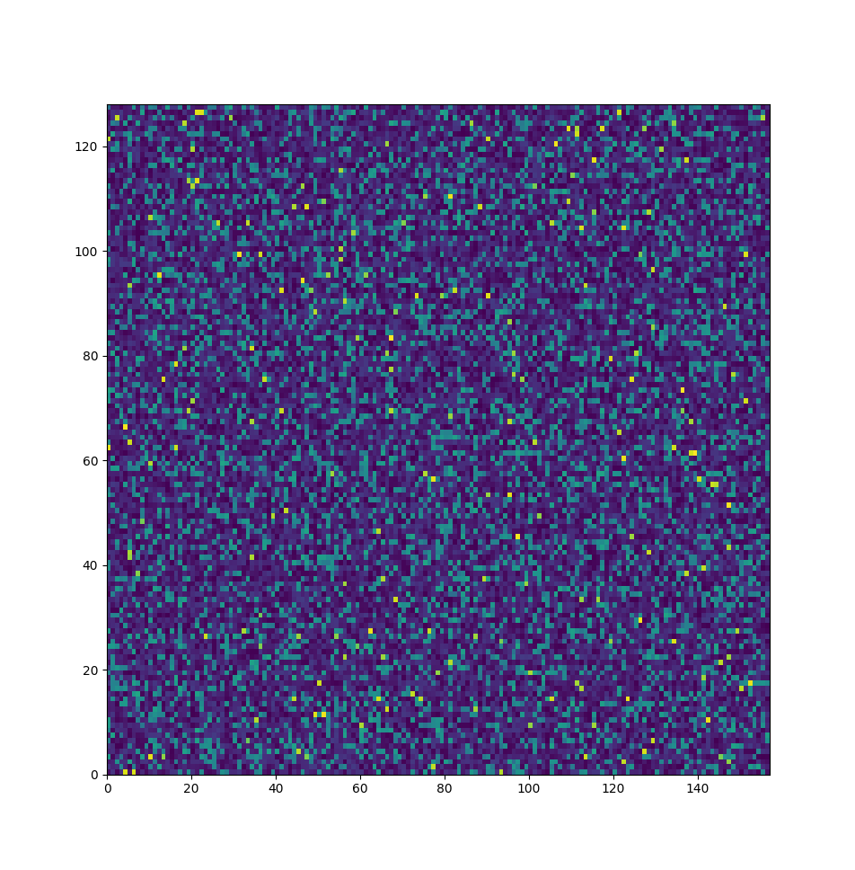

## Research Notes
### Experiment 1: Create ML model and test with standard dataset (MNIST)
- Done, checked and saw that the model is working, and being trained

### Experiment 2: Create Initial Simulator Implementation
- Done, created simulator with effects of sirens and random noise.

### Experiment 3: Run Simulator on Real World Data.
- Failed.
- Ran on live data, did not work. False positives are always being triggered except on the occasions of 
	- loud noises 
	- no sound
- Possible causes of this problem
	- Model has overfit to the scaling of the sound of the generator distribution, so when an ood sound is played, it predicts yes.
		- doesn't really explain why loud noises aren't really a trigger
	- Simulator Noise is Too Naive
		- after an analysis of the spectrograms for outside noise compared to the noise we are generating, there seems to be a significant difference in structure.
		- Though it was mentioned that in domain randomization, that can train on randomized objects, it seems that for this noise, we need to but in the basic structure.

### Experiment 3.1 Simulator Noise is Too Naive

*Real Recorded Random Wind Noise*

*Current Simulator Noise Generation*

Next Step 3.1.1: Try to get real noise samples, agument them and use them as noise. This works fine

Top is real recorded noise
Bottom is generated noise.

Next Step 3.1.2: We can try doing a naive model of noise. Where we can get the max and min values of given, along with the max and min changes between times. This way, we can model specific sounds. To prevent us from labeling every detail, we can try separating by a rate of change threshold and probability.

### Experiment 3.2 Siren Counter Examples
The Model is now tricked by counter examples in noise, such as single frequencies. We need to counter this by adding in structured noise. 
